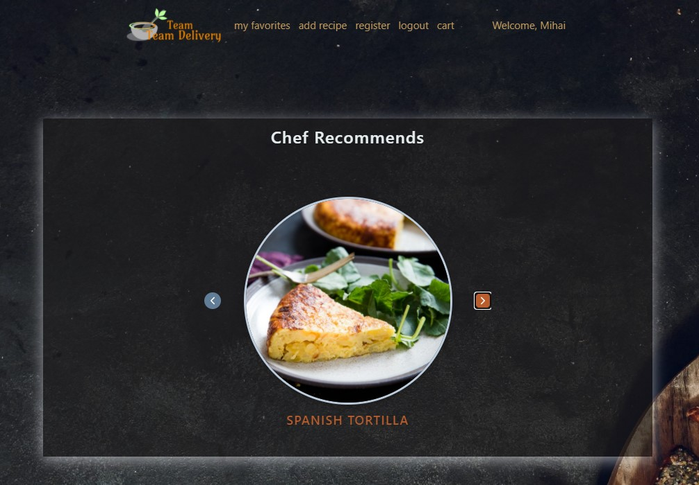
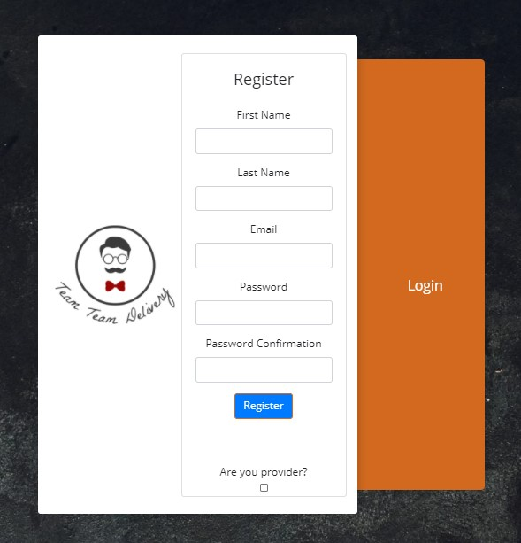
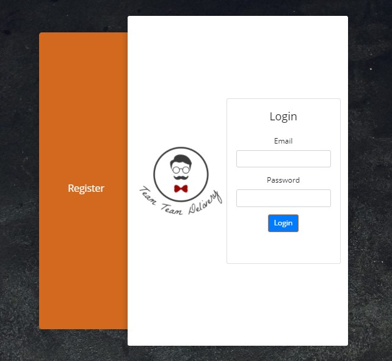
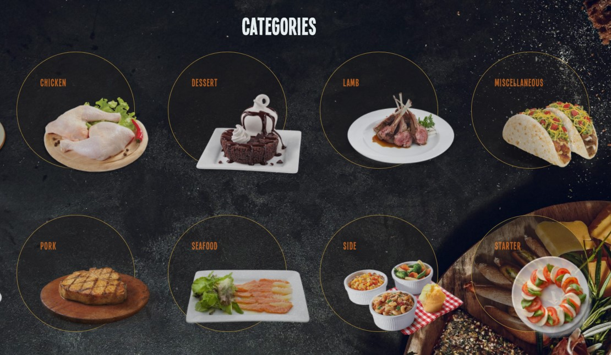
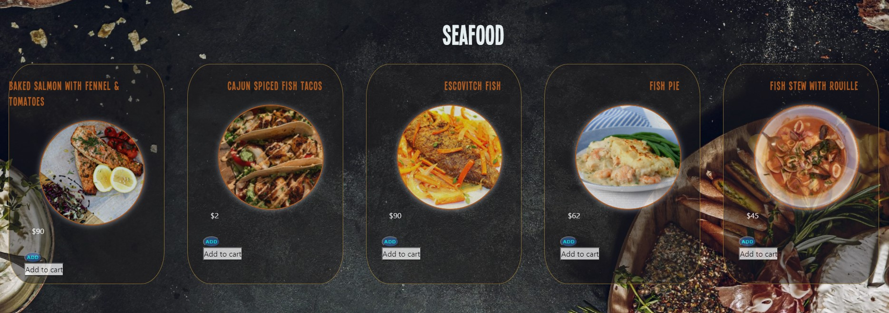
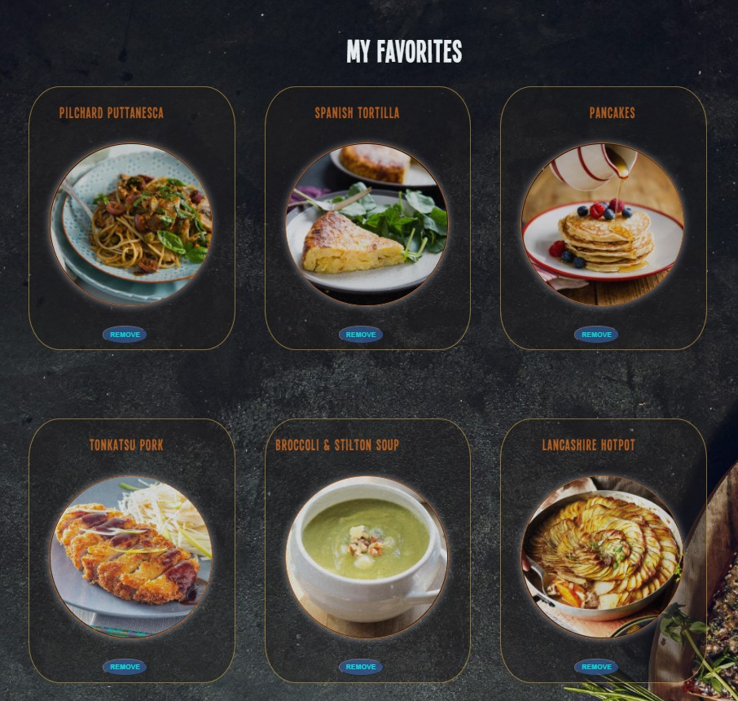
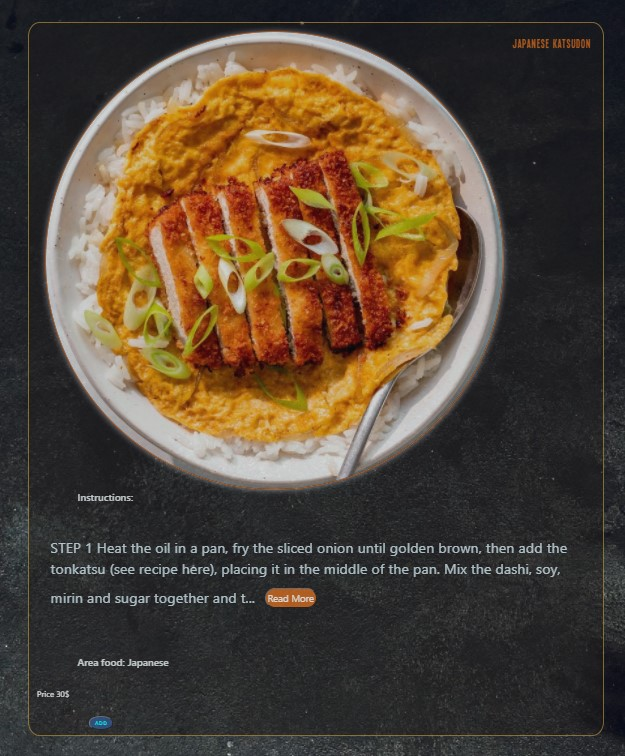

Team-Team_Delivery is an application witch is used in the online food delivery.

  

An user can be registered. After the registration is successfully made, the user recives an email for confirmation of the account. Imediately after confirmation the user can be logged in

  
  

The menu is organized in categories, each category having its own list of dishes.

  
  

An user can create its own list of favorites.

For the individuals who cook, the application has embedded the recipes list for each dish from the menu.

Back-end: https://github.com/Mihaicv/Team-Team_Delivery-FrontEnd

